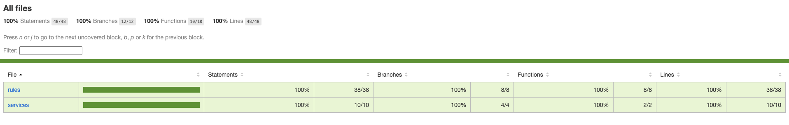

<h1 align="center">🛡️ API de Validação de Senha</h1>

<p align="center">
  
  
  
</p>

Solução desenvolvida para o [desafio técnico do Itaú](https://github.com/itidigital/backend-challenge) de Analista de Engenharia de Software. A API valida senhas com base em critérios de segurança, priorizando uma arquitetura limpa, extensível e altamente testada.

---

### 🛠️ Tecnologias Utilizadas

<p align="left">
  
  
  
  
  
  
</p>

---

### 📏 Regras de Validação

Para ser considerada válida, a senha deve atender simultaneamente aos seguintes critérios:

-  Deve ter nove ou mais caracteres.
-  Deve ter ao menos 1 dígito.
-  Deve ter ao menos 1 letra minúscula.
-  Deve ter ao menos 1 letra maiúscula.
-  Deve ter ao menos 1 caractere especial **(!@#$%^&*()-+)**.
-  Não deve possuir caracteres repetidos.
-  Não deve conter espaços em branco.

---

### 🚀 Começando (Setup)

#### 📋 Pré-requisitos

Você precisará do **Docker** ou **Node.js v20+** e **npm** instalados.

#### 🏁 Passos Iniciais

1. **Clone o repositório**:

```bash
git clone git@github.com:Keyeight/password-validation-api-challenge.git
```

2. **Acesse a pasta**:

```bash
cd password-validator-api
```

3. **Configure o ambiente (.env)**:

Crie um arquivo .env conforme o exemplo abaixo:

```bash
PORT=8080
NODE_ENV=development
```
### 🐳 Executando com Docker

```bash
docker-compose up --build
```
<small>A API estará disponível em http://localhost:8080</small>

### 💻 Executando Localmente

```bash
npm install
npm run dev
```
### 🧪 Testes Unitários e Integração

A aplicação foi desenvolvida focando em **100% de cobertura de código**, garantindo que todas as regras de negócio e fluxos de exceção sejam validados.

- **Testes de Unidade**: Validam cada regra isoladamente e o comportamento do service.
- **Testes de Integração**: Validam o fluxo completo (Request -> Controller -> Service -> Response).



Comandos: 

```bash
npm run test        #Executa todos os testes + Coverage
npm run test:unit   #Executa apenas testes unitários
npm run test:int    #Executa apenas testes de integração 
```

### 📡 Design da API

#### **`POST`** `/api/password/validate`

- Corpo da Requisição **(JSON)**:

```json
{
  "password": "AbTp9!fok"
}
```

- Resposta (Sucesso - **200 OK**): 

```json
{
  "isValid": true
}
```

- Resposta (Erro - **400 Bad Request**): 

```json
{
  "isValid": false,
  "errors": [
    "A senha deve conter no mínimo 9 caracteres.",
    "A senha não deve conter caracteres repetidos."
  ]
}
```

### Testando a API

#### 📥 Collection para Testes

Para facilitar a validação, utilize a collection do **Insomnia** (YAML) com todos os cenários pré-configurados:

* 📁 [Collection de Testes (YAML)](./src/docs/insomnia-collection.yaml)

> <small>**Como baixar:** Fazer o download usando o "raw file" que o GitHub fornece. </small>

> <small>**Como usar:** No Insomnia, vá em `Application` -> `Import` -> `From File` e selecione o arquivo baixado.</small>

#### 💡 cURL para Testes 

Para validar rapidamente, sem sair do terminal, você pode usar os comandos `curl` sugeridos:

- Exemplo de Senha Válida **(Status 200)**

```bash
curl -X POST http://localhost:8080/api/password/validate \
     -H "Content-Type: application/json" \
     -d '{"password": "AbTp9!fok"}'
```

- Exemplo de Senha Inválida **(Status 400)**

```bash
curl -X POST http://localhost:8080/api/password/validate \
     -H "Content-Type: application/json" \
     -d '{"password": "aa"}'     
```

### 🧠 Decisões técnicas

#### 🔹 Arquitetura

A solução foi organizada para atender aos critérios de **alta coesão** e **baixo acoplamento**.

- **Clean Code & SOLID:**
  1. **Aplicação do Princípio de Responsabilidade Única (SRP)**, onde cada regra de validação tem sua própria classe que possui apenas uma responsabilidade.
  2. **Inversão de Dependência (DIP)** pois o service de validação depende de uma abstração de regras e não de implementações concretas, facilitando a troca ou adição de componentes e tornando o código altamente testável.
  3. **Abstração e Extensibilidade (Open/Closed Principle)** utilizando de interfaces para definir o contrato das regras permitindo adicionar novos critérios de validação sem alterar o código existente .
  4. **Arquitetura em Camadas** separando a camada de entrada e resposta *(Controller)*, a orquestração das regras *(Service)* e os validadores isolados *(Rules)*.

> <smart> **Nota**: Essa abordagem foi adotada para facilitar a manutenção, legibilidade de código, facilitar os testes e favorecer a extensibilidade com baixo acoplamento.</small>

#### 🔹 Regras Independentes: 

Cada critério de validação foi implementado de forma isolada, como:
- tamanho mínimo
- presença de dígito
- presença de letra maiúscula
- presença de letra minúscula
- presença de caractere especial
- ausência de caracteres repetidos
- ausência de espaços em branco

#### 🔹 Estratégia de validação

A aplicação executa todas as regras e retorna todos os erros encontrados de uma vez.

Essa decisão foi tomada para melhorar o design da API e a experiência de quem consome a API, evitando múltiplas chamadas para descobrir os problemas da senha.

#### 🔹 Separação entre app e server

A aplicação foi dividida em dois arquivos principais:

- `app.ts`: configurações de rotas e middlewares.
- `server.ts`: responsável por inicializar o servidor e escutar a porta.

Essa separação segue boas práticas de organização e facilita testes.

#### 🐳 Containerização

Foi utilizado Docker para permitir a execução da aplicação em diferentes ambientes, garantindo consistência e facilitando a padronização do ambiente.

#### 🔹 Testes: 

Foram implementados: 
- Testes unitários para **regras** e **services**
- Testes de integração para o fluxo completo da API

Os testes atingem ***100% de cobertura de código*** nos principais fluxos da aplicação, garantindo maior confiabilidade.

#### 📌 Premissas adotadas
- Espaços em branco são considerados inválidos em qualquer posição. 
- A API retorna todos os erros de validação em uma única resposta.
- A validação de entrada é tratada no controller.
- As regras de negócio da senha ficam no service e nas rules.
- O endpoint retorna status 200 para senha válida e status 400 para senha inválida ou entrada inválida.


### ✒️ Autor

| [<br><sub>Keyth Alves Ferreira</sub>](https://github.com/Keyeight) |  
| :---: | 


<p align="center">
  <sub>Projeto desenvolvido com foco em Clean Code e SOLID para o processo seletivo backend do Itaú.</sub>
</p>

